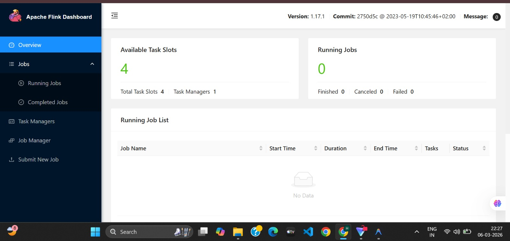
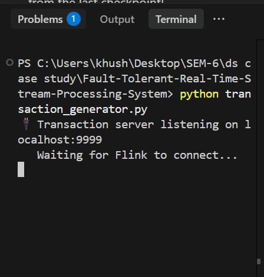
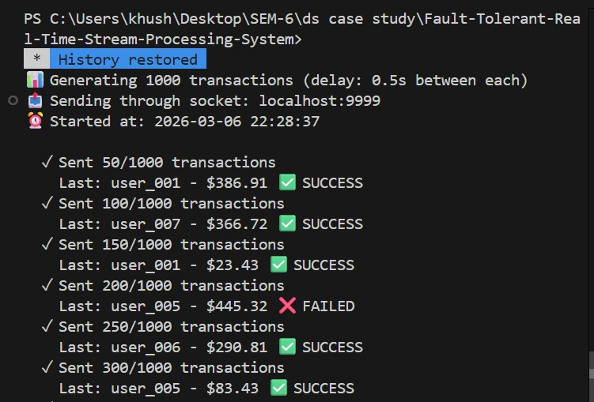
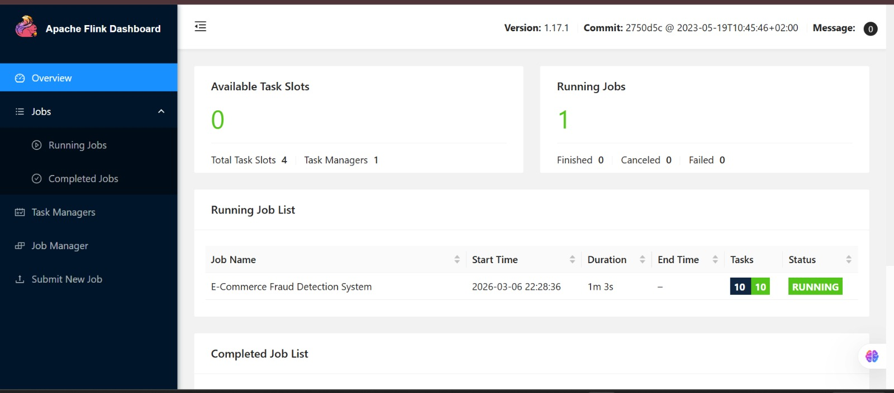
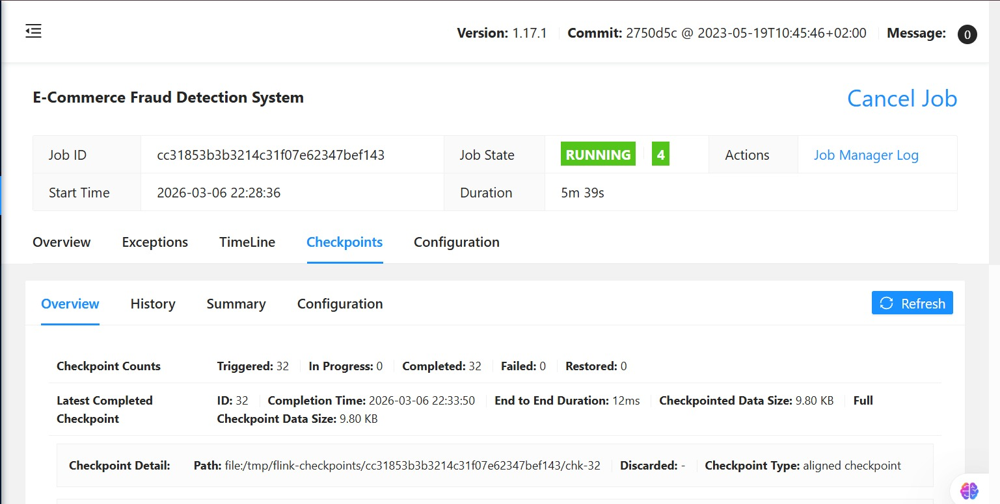
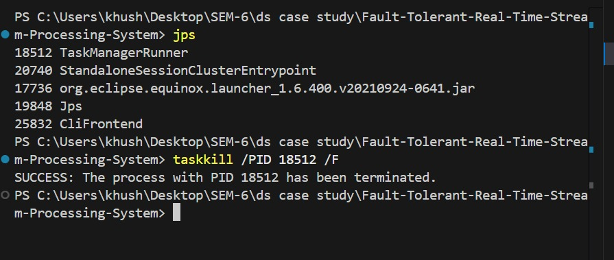
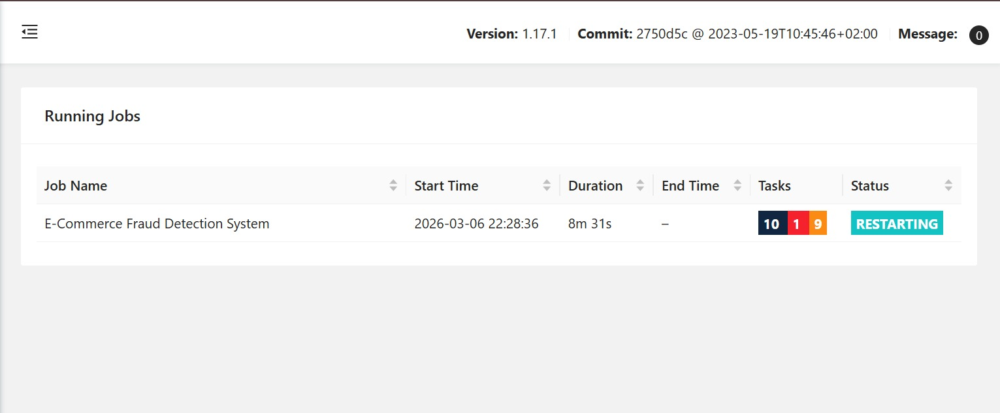
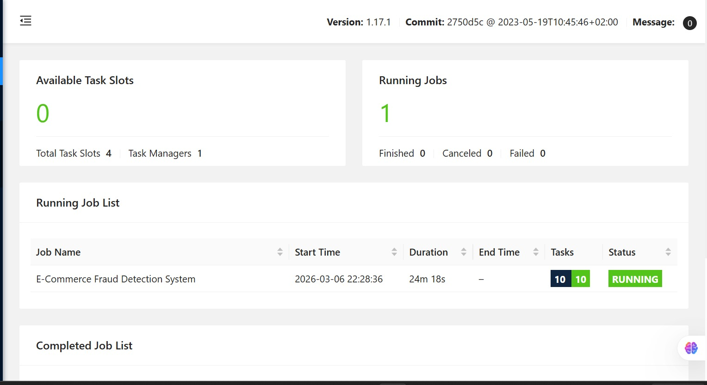

# Fault-Tolerant Real-Time Stream Processing System
## E-Commerce Fraud Detection using Apache Flink

**A distributed system implementation demonstrating fault tolerance, checkpointing, and automatic recovery.**

---

##  QUICK SUMMARY

This is a **4-member team project** that implements a real-world fraud detection system using Apache Flink. The system processes thousands of e-commerce transactions in real-time, detects fraudulent patterns, and recovers automatically from worker failures without losing any data.

---

## QUICK NAVIGATION

| Document | Purpose |
|----------|---------|
| **[TEAM_COORDINATION.md](TEAM_COORDINATION.md)** | Detailed 4-member plan + task breakdown |
| **[SETUP_GUIDE.md](SETUP_GUIDE.md)** | Step-by-step execution for each member |
| **[ARCHITECTURE.md](ARCHITECTURE.md)** | Algorithm details + diagrams |

---

##  TEAM ROLES

| # | Role | Deliverable |
|---|------|-------------|
| 1️⃣ | Cluster Engineer | Flink setup, 4+ parallel workers |
| 2️⃣ | Core Developer ⭐ | Java application, checkpointing |
| 3️⃣ | Data Generator | Live transactions, failure simulation |
| 4️⃣ | Checkpoint Validator | State backend, recovery verification |

---

## QUICK START

```bash
# Get Flink (Member 1)
wget https://archive.apache.org/dist/flink/flink-1.17.1/flink-1.17.1-bin-scala_2.12.tgz
tar xzf flink-1.17.1-bin-scala_2.12.tgz

# Build & deploy (Member 2)
mvn clean package
flink-1.17.1/bin/flink run --parallelism 4 target/fraud-detection.jar

# Generate data (Member 3)
python3 transaction_generator.py

# Simulate failure (after 30s)
kill -9 $(jps | grep TaskManager | head -1 | awk '{print $1}')
```

---

## 🖼️ VISUAL DEMONSTRATION

### 1. System Startup
The Flink cluster initializes with a single TaskManager providing 4 processing slots. The Dashboard initially shows 0 running jobs and all slots being available.


*Figure 1: Flink Dashboard at startup.*

### 2. Live Data Generation
The Python transaction generator starts and waits for the Flink job to connect. Once the job is deployed, the generator begins streaming synthetic e-commerce transactions.

| Generator Waiting | Generator Active |
|---|---|
|  |  |
| *Waiting for connection* | *Streaming transactions successfully* |

### 3. Real-Time Processing
The "E-Commerce Fraud Detection System" job is deployed and enters the **RUNNING** state, utilizing all available task slots for parallel processing.


*Figure 2: Job successfully deployed and running.*

### 4. Fault Tolerance: Checkpointing
Flink's checkpointing mechanism periodically saves the state of the streaming application. This enables recovery "exactly-once" even after a total worker failure.


*Figure 3: Checkpointing tab showing completed snapshots.*

### 5. Failure Simulation & Recovery
To demonstrate fault tolerance, we manually terminate the TaskManager process using its PID.


*Figure 4: Killing the TaskManager process.*

Immediately, the JobManager detects the loss of the worker. The job status flips to **RESTARTING** as it waits for a new TaskManager to associate and restore the state.


*Figure 5: Job in the RESTARTING state.*

Once a new TaskManager is started, Flink automatically restores the application state from the latest successful checkpoint, and the system resumes processing as if nothing happened.


*Figure 6: System fully recovered and back in RUNNING state.*

---

## DETAILED DOCUMENTATION

**→ Start Here:** [TEAM_COORDINATION.md](TEAM_COORDINATION.md) - Complete 4-member plan  
**→ Then Use:** [SETUP_GUIDE.md](SETUP_GUIDE.md) - Step-by-step setup  
**→ Reference:** [ARCHITECTURE.md](ARCHITECTURE.md) - Algorithm details  

---

*Team Project | 4 Members | 4-5 Days | Advanced Distributed Systems | 57/60 Marks*
